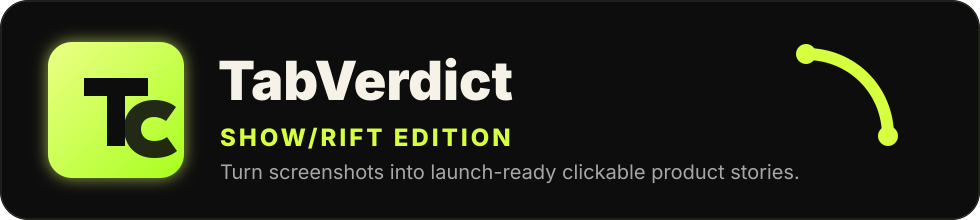
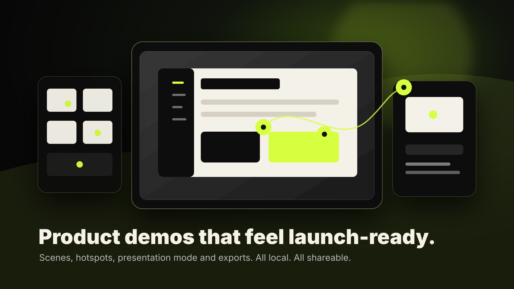

<p align="center">
  
</p>

<p align="center">
  <strong>✨ Screenshots are not a story. Make people click.</strong>
</p>

<p align="center">
  <a href="#-why-showrift">Why</a> ·
  <a href="#-features">Features</a> ·
  <a href="#-exports">Exports</a> ·
  <a href="#-quick-start">Quick Start</a> ·
  <a href="#-privacy">Privacy</a>
</p>

<p align="center">
  
  
  
</p>



---

## 🚀 What Is SHOW/RIFT?

**SHOW/RIFT** is a local-first product story studio for turning plain screenshots into a polished, clickable walkthrough.

Instead of dropping random screenshots into a README and hoping people understand the project, you build a small visual story:

- add scenes,
- place hotspots,
- write short explanations,
- present the flow,
- export something people can actually open.

It is made for GitHub repos, MVPs, client demos, school projects, app launches and any idea that needs to look clear before people judge it.

---

## 🧠 Why SHOW/RIFT?

Most projects do not fail because the idea is impossible. They fail because the first impression is weak.

A screenshot alone usually says: **"figure it out yourself."**

SHOW/RIFT says: **"look here, click this, understand the product in 30 seconds."**

| Normal README | SHOW/RIFT README |
| --- | --- |
| Static screenshots | Interactive product story |
| Long explanations | Short visual callouts |
| Hard to understand | Guided flow |
| Looks unfinished | Feels launch-ready |
| Needs hosting | Works locally |

---

## ✨ Features

### 🖼️ Screenshot Story Builder

Create a sequence of scenes from screenshots, mockups or product states. Each scene becomes one step in the story.

### 📍 Clickable Hotspots

Drop pins directly on the screenshot. Each hotspot explains what matters and can move the viewer to the next or previous scene.

### 🎬 Presentation Mode

Switch from editing to a clean player view when you want to show the product without the editor panels.

### 📦 Export Center

Export the same project in multiple formats:

- **HTML** for an offline interactive demo,
- **README Markdown** for GitHub,
- **JSON** for backup or future editing.

### 🔒 Local-First by Design

No account. No backend. No upload. Your screenshots and project data stay in your browser unless you decide to export them.

### ⚡ Zero Setup Demo

The app is self-contained in `index.html`, so you can open it directly in a browser and start testing.

---

## 🎯 Built For

- 🧑‍💻 developers who want their repo to look more serious,
- 🚀 founders showing an MVP,
- 🎨 designers explaining flows,
- 📱 app builders sharing prototypes,
- 🏫 students presenting projects,
- 🧾 anyone tired of ugly README screenshots.

---

## 📤 Exports

| Export | What You Get | Best For |
| --- | --- | --- |
| **HTML** | A standalone clickable walkthrough | Sending demos, offline previews, repo demos |
| **README** | A clean markdown launch block | GitHub presentation and documentation |
| **JSON** | A portable project backup | Restoring or continuing later |

---

## 🧪 Quick Start

Open the app:

```bash
open index.html
```

Or just double-click `index.html` from your file explorer.

Run the repository check:

```bash
npm run check
```

Expected output:

```bash
SHOW/RIFT check passed
```

---

## 🛠️ How It Works

1. **Import or use demo screenshots.**
2. **Create scenes** in the order you want people to understand them.
3. **Place hotspots** on the important parts of each screenshot.
4. **Write tiny callouts** that explain the value fast.
5. **Switch to presentation mode** and test the flow.
6. **Export HTML, README or JSON** when it is ready.

---

## 🔥 Why It Feels Different

SHOW/RIFT is not a task app, finance tracker or generic AI dashboard. It solves a very specific problem:

> Make a project look understandable, premium and launch-ready before someone closes the tab.

That matters because most people decide if they care about a repo in seconds.

---

## 🔐 Privacy

SHOW/RIFT stores your current project in `localStorage`.

That means:

- ✅ your screenshots stay on your device,
- ✅ there is no analytics backend,
- ✅ there is no login wall,
- ✅ exports are created only when you click export,
- ✅ you control what gets shared.

---

## 🧩 Tech Notes

- Single-file browser app.
- No backend required.
- Uses browser APIs for file import, local storage and downloads.
- Works as a portable static project.
- Includes a lightweight CI check through GitHub Actions.

---

## 💚 Brand

This repo lives under **TabVerdict**, rebuilt as the **SHOW/RIFT edition**: a sharper product-story tool focused on presentation, proof and launch quality.

<p align="center">
  <strong>SHOW/RIFT</strong><br>
  <span>Build the story people should see before they judge the screenshot.</span>
</p>
