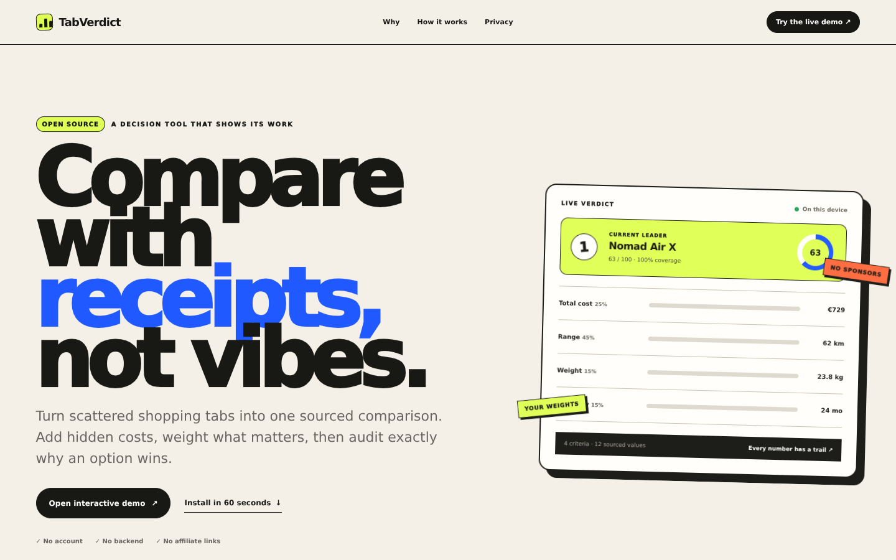
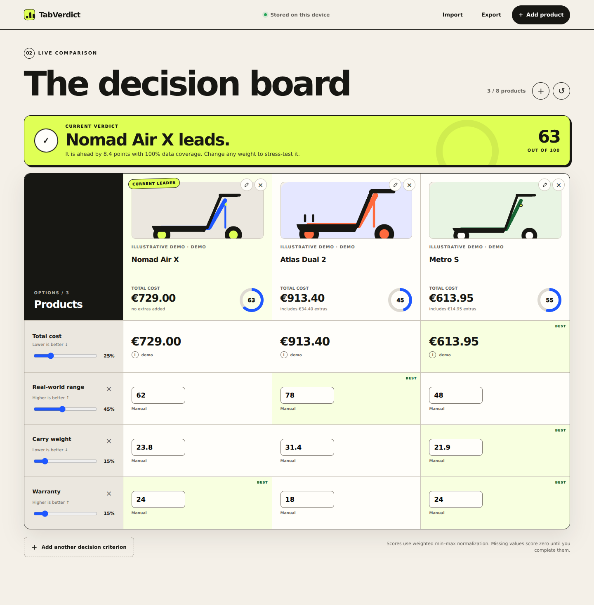
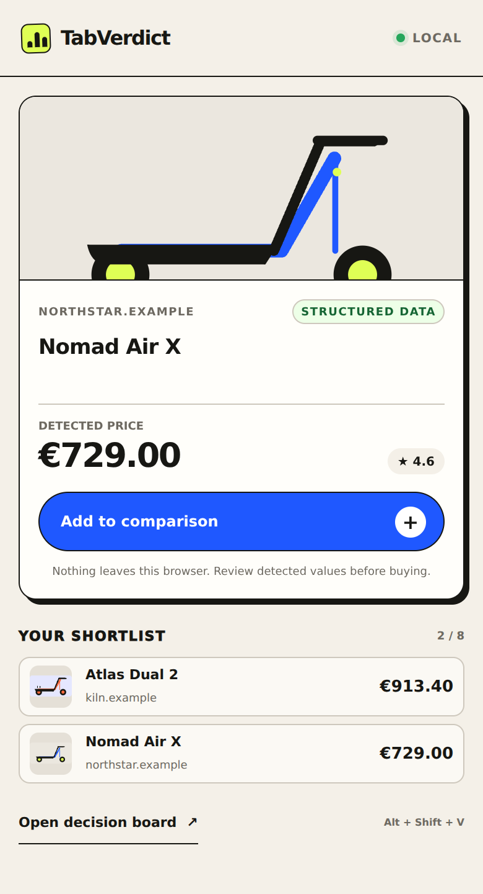
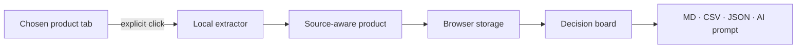

<p align="center">
  
</p>

<h1 align="center">TabVerdict</h1>

<p align="center">
  <strong>Compare with receipts, not vibes.</strong><br>
  Turn product tabs into a sourced, weighted and private verdict.
</p>

<p align="center">
  <a href="README.es.md">Español</a> ·
  <a href="https://mmoya113.github.io/tabverdict/">Live demo</a> ·
  <a href="#-install-in-60-seconds">Install</a> ·
  <a href="#-how-the-score-works">Scoring</a> ·
  <a href="PRIVACY.md">Privacy</a>
</p>

<p align="center">
  <a href="https://github.com/mmoya113/tabverdict/actions/workflows/ci.yml"></a>
  
  
  <a href="LICENSE"></a>
  <a href="https://github.com/mmoya113/tabverdict/stargazers"></a>
</p>



## The 10-second version ⚡

Most shopping comparisons fail in one of three ways: a store controls the filters, an affiliate site controls the winner, or you copy everything into a spreadsheet by hand.

**TabVerdict is the missing fourth option.** Click the extension on a product page, add the costs and criteria that matter to you, and get a ranking whose formula and sources you can inspect. No account, no backend, no sponsored winner.

> [!IMPORTANT]
> TabVerdict is a decision aid, not a purchasing recommendation. Prices and specifications can change; verify them at the linked source before paying.

## Why this is different 🧭

| Typical comparison tool | TabVerdict |
| --- | --- |
| Decides which criteria matter | **You** create and weight the criteria |
| Hides the ranking formula | Shows every normalized value and contribution |
| Earns money from referrals | Contains **zero affiliate links** |
| Sends browsing data to a server | Stores the board on your device |
| Shows the sticker price | Calculates price + shipping + tax + fees |
| Produces an answer with no trail | Preserves a source and extraction method |
| Locks data into its UI | Exports Markdown, CSV, JSON and an AI-ready prompt |

## See it in action 👀

<table>
  <tr>
    <td width="68%"></td>
    <td width="32%"></td>
  </tr>
  <tr>
    <td align="center"><strong>Decision board</strong><br><sub>Change a weight and the verdict responds immediately.</sub></td>
    <td align="center"><strong>One-click capture</strong><br><sub>Structured data first; honest review state when extraction is uncertain.</sub></td>
  </tr>
</table>

The included scooter comparison is explicitly **illustrative demo data**. Press “Load demo data” to explore every interaction without polluting a real shortlist.

## Features that are already real ✅

- 🧲 **One-click product capture** from the active tab.
- 🧾 **Schema.org Product/Offer extraction** with Open Graph and visible-price fallbacks.
- 🔗 **Field-level provenance**: source URL, method and label travel with captured values.
- 💸 **Landed cost**: base price, shipping, fixed/percentage tax and fees.
- 🎚️ **Custom decision criteria** with direction, weight, unit and per-product values.
- 🧮 **Transparent weighted scoring** with visible coverage and no invented values.
- 📉 **Local price snapshots** when the same product is captured again at a new price.
- ↩️ **Undo after deletion**, editable products and a clear eight-option board limit.
- 📤 **Markdown, CSV, JSON and AI-prompt exports** generated entirely in the browser.
- 🛡️ **Spreadsheet formula-injection protection** in CSV exports.
- 📱 **Responsive horizontal comparison** with touch-sized controls.
- ♿ **Keyboard focus, semantic dialogs and reduced-motion support**.
- 🌐 **Standalone web demo** backed by localStorage; the extension uses `chrome.storage.local`.
- 🚫 **No runtime dependencies, analytics, accounts, remote scripts or backend**.

## Install in 60 seconds 🧩

TabVerdict is currently distributed as an unpacked open-source extension while the store packages are prepared.

### Chrome, Edge, Brave or Arc

1. Download this repository with **Code → Download ZIP**, then unzip it. Or clone it:

   ```bash
   git clone https://github.com/mmoya113/tabverdict.git
   ```

2. Open your browser's extension page:

   - Chrome / Brave / Arc: `chrome://extensions`
   - Edge: `edge://extensions`

3. Enable **Developer mode**.
4. Choose **Load unpacked** and select the `tabverdict` folder.
5. Pin TabVerdict. Open a product page and press its icon — or use <kbd>Alt</kbd> + <kbd>Shift</kbd> + <kbd>V</kbd>.

No build step and no `npm install` are required to use the extension.

### Try it before installing

Open the [interactive web demo](https://mmoya113.github.io/tabverdict/). Capture is disabled outside the extension, but manual products, scoring, editing, import/export and the full board work normally.

## A real workflow, end to end 🛒

1. **Open the options** you are considering in separate tabs.
2. **Press TabVerdict** on each tab. The popup previews what it detected before saving.
3. **Open the board** and correct anything uncertain. Heuristic captures are labelled rather than disguised as certainty.
4. **Add the real bill**: shipping, tax and platform/import fees.
5. **Create your criteria** — range, warranty, repairability, delivery time, weight, camera quality, whatever fits this decision.
6. **Move the weight sliders** until they reflect your priorities. The leader, score and margin update immediately.
7. **Follow the source marks** and fill missing evidence.
8. **Export the comparison** to keep it, share it, continue in a spreadsheet or ask an AI to challenge your assumptions.

## How the score works 🧮

There is no model, hidden coefficient or paid placement.

For each criterion, TabVerdict normalizes known values between 0 and 100. For a “higher is better” criterion:

$$n_{ij} = 100 \times \frac{x_{ij} - \min(x_j)}{\max(x_j) - \min(x_j)}$$

For “lower is better”, the numerator is reversed:

$$n_{ij} = 100 \times \frac{\max(x_j) - x_{ij}}{\max(x_j) - \min(x_j)}$$

The final score is the weighted average:

$$S_i = \frac{\sum_j w_j n_{ij}}{\sum_j w_j}$$

Practical rules:

- If every product has the same value, they all receive 100 for that criterion because it does not separate them.
- A missing value contributes **zero**, and the product's data-coverage percentage falls. TabVerdict never fills the gap with a guess.
- Weights do not need to sum to 100; they are normalized by the denominator.
- The score describes **your current inputs**. It does not claim universal product quality.

The implementation lives in [`src/lib/core.js`](src/lib/core.js), and the behavior is locked down by tests in [`tests/core.test.js`](tests/core.test.js).

## What gets extracted? 🔎

TabVerdict follows a conservative cascade:

1. `schema.org/Product` JSON-LD.
2. `Offer`, `AggregateRating`, brand and image structured fields.
3. Open Graph and product meta tags.
4. A small visible-price heuristic.
5. Manual review when confidence is insufficient.

It also collects specification pairs from product tables and definition lists for future criterion suggestions. Capture only runs after an explicit click; there is no always-on content script.



## Privacy and permissions 🔐

| Permission | Why it exists | What it does **not** do |
| --- | --- | --- |
| `activeTab` | Temporarily access the page after you click TabVerdict | Cannot watch every tab in the background |
| `scripting` | Inject the local extractor into that chosen page | Does not download or run remote code |
| `storage` | Save products, criteria and settings on this device | Does not create a cloud profile |
| `contextMenus` | Add an optional right-click capture shortcut | Does not inspect right-click activity elsewhere |

There is no `host_permissions` entry in the manifest, no telemetry SDK and no server endpoint in the codebase. Read the [plain-English privacy policy](PRIVACY.md) and [security policy](SECURITY.md).

## Architecture 🏗️

TabVerdict deliberately uses boring, inspectable technology:

```text
manifest.json             Manifest V3 permissions and entry points
popup.html / popup.css    Capture preview and shortlist
dashboard.html / .css     Responsive comparison board
src/content.js            Explicit, page-local product extraction
src/background.js         Context menu and capture orchestration
src/lib/core.js           Parsing, costs, scoring and exports
src/lib/storage.js        Chrome/localStorage adapter and migrations
src/dashboard.js          Board interactions and accessible dialogs
tests/                    Node-native behavioral tests
```

- **Vanilla HTML, CSS and JavaScript** — no framework lifecycle hiding state changes.
- **Zero runtime packages** — no supply-chain install is needed to load the extension.
- **One shared domain core** — scoring behaves identically in tests, extension and demo.
- **Progressive local fallback** — the same board runs on GitHub Pages without pretending it can capture tabs.

## Development 🧑‍💻

Requires Node.js 20+ only for checks and packaging.

```bash
npm test            # Node's built-in test runner
npm run validate    # Manifest, permission and artifact checks
npm run check       # Everything above
npm run package     # Build dist/tabverdict for zipping
```

The CI workflow runs the complete check and uploads an unpacked-extension artifact. Tagged versions also create a ZIP release.

## Current limits — stated plainly 🚧

- Extraction quality depends on the product page. Some stores render prices inside closed components or deliberately obfuscate markup; those captures are marked for review.
- Currency values are not converted automatically. Compare like-for-like currencies or enter converted values manually.
- The price history is capture-based, not a background tracker. TabVerdict does not continuously visit stores.
- The board compares up to eight products to keep decisions legible rather than turning into an infinite spreadsheet.
- Firefox packaging is not complete yet; the core is browser-agnostic, but the extension currently targets Chromium Manifest V3.

## Roadmap 🗺️

- [ ] Signed Chrome Web Store and Edge Add-ons releases.
- [ ] Firefox package using the WebExtensions compatibility layer.
- [ ] Criterion suggestions from captured specification tables — always user-approved.
- [ ] Side-by-side price snapshot timeline.
- [ ] Optional manual exchange-rate table stored locally.
- [ ] Shareable, encrypted comparison files with no hosted account.
- [ ] Community extraction fixtures for difficult storefronts.

Roadmap items are intentionally not rendered as fake controls in the current UI. If a button exists today, it works today.

## Contributing 🤝

Bug reports, store fixtures, accessibility reviews and focused pull requests are welcome. Please read [CONTRIBUTING.md](CONTRIBUTING.md) before opening a PR.

Good first contributions:

- Add an anonymized JSON-LD fixture from a storefront TabVerdict misreads.
- Improve European or international money parsing with a failing test first.
- Test keyboard and screen-reader flows.
- Translate the documentation without changing product claims.

Please report security problems privately through [GitHub Security Advisories](https://github.com/mmoya113/tabverdict/security/advisories/new), not a public issue.

## If this saves you from one bad purchase… ⭐

Star the repository so other people can find an independent alternative to affiliate comparison pages. A star also tells us which roadmap to prioritize — without analytics or tracking you.

## License

[MIT](LICENSE) © 2026 TabVerdict contributors.

---

<p align="center"><strong>Your criteria. Your evidence. Your verdict.</strong></p>
